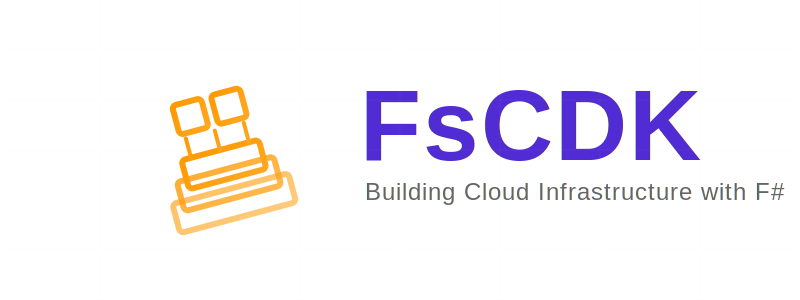

<div align="center">
  
</div>

<div align="center">

[](https://github.com/totallymoney/FsCDK/actions/workflows/build.yml)

</div>

FsCDK is a robust F# library for AWS Cloud Development Kit (CDK), enabling you to define cloud infrastructure using F#'s type safety and functional programming features. It provides a natural F# interface to AWS CDK, allowing you to build reliable and maintainable cloud infrastructure as code.

## Features

- **Type-Safe Infrastructure**: Leverage F#'s strong type system to catch configuration errors at compile time
- **Functional-First Approach**: Use F#'s functional programming features to create reusable and composable infrastructure components
- **Native AWS CDK Integration**: Full access to AWS CDK constructs and patterns with F#-friendly APIs
- **Immutable Infrastructure**: Define your infrastructure using immutable constructs, promoting reliable and predictable deployments
- **IDE Support**: Excellent tooling support with type hints and IntelliSense in your favorite F# IDE

## Quick Start

1. Install the package:
```fsharp
dotnet add package FsCDK
```

1. Create your first stack:
```fsharp
open Amazon.CDK
open Amazon.CDK.AWS.S3
open FsCDK

let config = Config.get () // Load Environment Variables

stack "MyFirstStack" {
    app {
        context "environment" "production"
        context "feature-flag" true
        context "version" "1.2.3"
    }

    environment {
        account config.Account
        region config.Region
    }
    
    stackProps {
        stackEnv
        description "My first CDK stack in F#"
        tags [ "project", "FsCDK"; "owner", "me" ]
    }

    lambda "Playground-SayHello" {
        runtime Runtime.DOTNET_8
        handler "Playground::Playground.Handlers::sayHello"
        code "../Playground/bin/Release/net8.0/publish"
        timeout 30.0
        memory 256
        description "A simple hello world lambda"
    }
}
```

1. Deploy your infrastructure:
```bash
cdk synth   # Review the generated CloudFormation template
cdk deploy  # Deploy to AWS
```

## Documentation

For detailed documentation, examples, and best practices, visit our [Documentation Site](https://totallymoney.github.io/FsCDK/).

## Examples

Check out the [samples directory](./samples) for complete examples of common infrastructure patterns implemented with FsCDK.

## Contributing

Contributions are welcome! Whether it's:
- Reporting a bug
- Submitting a fix
- Proposing new features

Please check out our [Contributing Guide](CONTRIBUTING.md) for guidelines about how to proceed.

## License

This project is licensed under the MIT License - see the [LICENSE](LICENSE) file for details.
