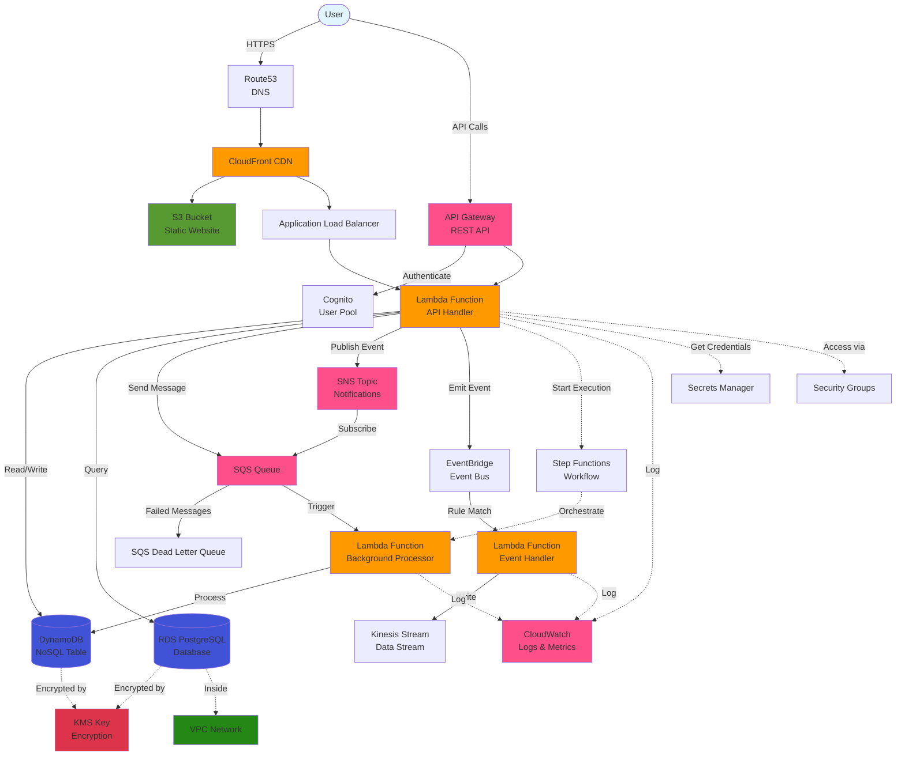

<div align="center">
  
</div>

<div align="center">

[](https://github.com/totallymoney/FsCDK/actions/workflows/build.yml)

</div>

FsCDK is an F# library for the AWS Cloud Development Kit (CDK), enabling you to define cloud infrastructure using F#'s type safety and functional programming style. It provides F#-friendly builders on top of AWS CDK constructs, so you can compose infrastructure in a concise, declarative way to build reliable and maintainable cloud infrastructure as code.

## Features

- **Type-Safe Infrastructure**: Leverage F#'s strong type system to catch configuration errors at compile time
- **Functional-First Approach**: Use F#'s functional programming features to create reusable and composable infrastructure components
- **Native AWS CDK Integration**: Full access to AWS CDK constructs and patterns with F#-friendly APIs
- **Immutable Infrastructure**: Define your infrastructure using immutable constructs, promoting reliable and predictable deployments
- **IDE Support**: Excellent tooling support with type hints and IntelliSense in your favorite F# IDE

## Quick Start

1) Install the package:
```bash
dotnet add package FsCDK
```

2) Define a simple stack with a bucket and a Lambda function using a single builder API:
```fsharp
open Amazon.CDK
open Amazon.CDK.AWS.S3
open Amazon.CDK.AWS.Lambda
open FsCDK

let config = Config.get () // e.g., reads AWS account and region from env

stack "MyFirstStack" {
    app {
        context "environment" "production"
        context "feature-flag" true
        context "version" "1.2.3"
    }

    environment {
        account config.Account
        region config.Region
    }

    stackProps {
        stackEnv
        description "My first FsCDK stack"
    }

    // S3 bucket
    bucket "MyBucket" {
        versioned true
        encryption BucketEncryption.S3_MANAGED
        blockPublicAccess BlockPublicAccess.BLOCK_ALL
    }

    // Lambda function
    lambda "HelloFunction" {
        runtime Runtime.DOTNET_8
        handler "Playground::Playground.Handlers::sayHello"
        code "../Playground/bin/Release/net8.0/publish"
        timeout 30.0
        memory 256
        description "A simple hello world lambda"
    }
}
```

3) Synthesize and deploy:
```bash
cdk synth   # Review the generated CloudFormation template
cdk deploy  # Deploy to AWS
```

## Documentation

For detailed documentation, examples, and best practices, visit our [Documentation Site](https://totallymoney.github.io/FsCDK/).

Notes:
- Defaults and configuration come from AWS CDK and your code; review the synthesized template to verify settings meet your needs.
- You can mix FsCDK builders with direct AWS CDK constructs anywhere you need lower-level control.

## Supported AWS Services

FsCDK provides F# builders for 30+ AWS services across all major categories:

| Service | What it does |
|---------|--------------|
| **ALB** (Application Load Balancer) | Distributes incoming HTTP/HTTPS traffic across multiple targets - [📚 Docs with learning resources](https://totallymoney.github.io/FsCDK/alb-secrets-route53.html) |
| **API Gateway** (REST & HTTP API) | Creates REST and HTTP APIs to expose your backend services - [📚 Docs with learning resources](https://totallymoney.github.io/FsCDK/api-gateway-v2.html) |
| **App Runner** | Fully managed container service for web apps and APIs |
| **AppSync** | Builds managed GraphQL APIs with real-time data synchronization |
| **Bastion Host** | Secure SSH access to instances in private subnets - [📚 Docs with learning resources](https://totallymoney.github.io/FsCDK/bastion-host.html) |
| **Certificate Manager** | Manages SSL/TLS certificates for secure connections - [📚 Docs with learning resources](https://totallymoney.github.io/FsCDK/certificate-manager.html) |
| **CloudFront** | Content delivery network (CDN) for fast global content distribution |
| **CloudHSM** | Hardware security modules for cryptographic key storage |
| **CloudWatch** | Monitors resources with alarms, log groups, metric filters, subscription filters, dashboards, and synthetic canaries |
| **Cognito** | User authentication and authorization for web and mobile apps |
| **DocumentDB** | MongoDB-compatible document database |
| **DynamoDB** | Fully managed NoSQL database for key-value and document data |
| **EC2** | Virtual servers in the cloud |
| **ECR** (Elastic Container Registry) | Stores and manages Docker container images |
| **ECS** (Elastic Container Service) | Runs containerized applications using Docker and Fargate |
| **EFS** (Elastic File System) | Scalable file storage for Lambda and EC2 |
| **EKS** (Elastic Kubernetes Service) | Managed Kubernetes clusters for container orchestration |
| **ElastiCache** | In-memory caching with Redis and Memcached |
| **Elastic Beanstalk** | Platform-as-a-Service (PaaS) for deploying applications |
| **Elastic IP** | Static IPv4 addresses for dynamic cloud computing |
| **EventBridge** | Event bus for connecting applications with event-driven architecture |
| **IAM** (Identity & Access Management) | Controls access to AWS resources with users, roles, and policies |
| **Kinesis** | Real-time data streaming for analytics and processing |
| **KMS** (Key Management Service) | Creates and manages encryption keys |
| **Lambda** | Runs code without managing servers (serverless functions) with cost optimization controls |
| **Network Load Balancer** | High-performance TCP/UDP load balancer |
| **OIDC Provider** | Federated identity using OpenID Connect |
| **RDS** (Relational Database Service) | Managed relational databases (PostgreSQL, MySQL, etc.) |
| **Route53** | DNS service and domain name management |
| **S3** (Simple Storage Service) | Object storage for files, backups, and static websites |
| **Secrets Manager** | Securely stores and rotates database credentials and API keys |
| **SNS** (Simple Notification Service) | Pub/sub messaging for sending notifications |
| **SQS** (Simple Queue Service) | Message queuing for decoupling and scaling applications |
| **SSM** (Systems Manager) | Manages parameters and documents for configuration |
| **Step Functions** | Coordinates multiple AWS services into serverless workflows |
| **VPC** (Virtual Private Cloud) | Isolated network environment for your AWS resources |
| **X-Ray** | Distributed tracing for debugging and analyzing microservices |

### Additional Capabilities
- **Custom Resources** - Define custom CloudFormation resources
- **Lambda Powertools** - Production-ready observability for Lambda functions
- **Grants** - Simplified IAM permission management between resources
- **Tags** - Resource tagging across stacks
- **Production-Safe Defaults** - Security and reliability best practices built-in

## Examples

- See the repository's examples and samples (if available in the tree) for additional patterns such as API gateways, queues, and databases.

Here's a complex example serverless web application architecture you could build with FsCDK:



**Architecture Highlights:**
- **Frontend**: CloudFront CDN serving an S3-hosted static website with Route53 DNS
- **API Layer**: API Gateway with Cognito authentication, routing to Lambda functions
- **Compute**: Multiple Lambda functions handling different concerns (API, background jobs, events)
- **Storage**: DynamoDB for NoSQL data and RDS for relational data
- **Messaging**: SQS queues for async processing, SNS for pub/sub, EventBridge for event routing
- **Streaming**: Kinesis for real-time data ingestion
- **Orchestration**: Step Functions coordinating complex workflows
- **Security**: KMS for encryption, Secrets Manager for credentials, Security Groups for network control
- **Monitoring**: CloudWatch for centralized logging and metrics
- **Networking**: VPC for isolated network environment

All of these resources can be defined using FsCDK's type-safe computation expression builders!

## Contributing

Contributions are welcome! Whether it's:
- Reporting a bug
- Submitting a fix
- Proposing new features

Please check out our [Contributing Guide](CONTRIBUTING.md) for guidelines.

## License

This project is licensed under the MIT License - see the [LICENSE](LICENSE) file for details.
